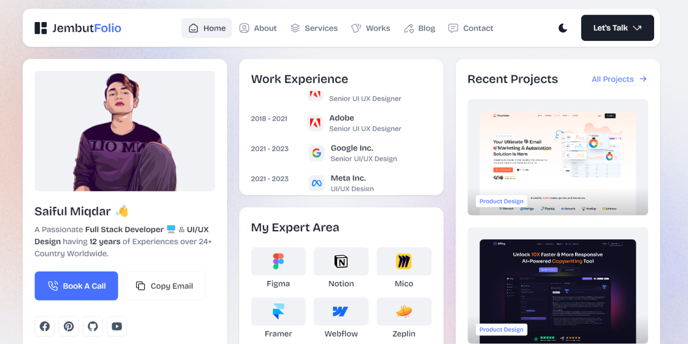

# WordPress Portfolio Template - Tailwind Minimal CSS Portfolio HTML5 Template

Live Preview : [See Here](https://ifulxploit.github.io/jembutfolio/)  

## Features

- Simple and clean UI with minimal animation effect
- Tailwind & Preline UI
- 9 Pages
- Responsive & Mobile Friendly

Do you intend to create your own Portfolio website? You are in the right place. **WordPress Portfolio Template - Tailwind CSS Minimal Personal Portfolio Template** is designed for all kinds of Online Professionals such as Product Designers, UI UX Designers, CVs, Resumes, Web Developers, Programmers, Frontend, Backend, Fullstack, Software Developers, Mobile App Developers, Personal Portfolio, or Personal Use.

**WordPress Portfolio Template - Tailwind Personal Portfolio Template** comes with modern UI with 30+ Modern UI Components. The template is 100% responsive and looks stunning on all types of screens and devices.

Moreover, **WordPress Portfolio Template** is a well-presented and documented HTML template built with the world's most popular CSS framework, TailwindCSS, HTML5, CSS3, SCSS, JS, and many other modern technology features. It offers an eye-pleasing, flawless & stunning User Interface with a modern look.

**WordPress Portfolio Template** is fully compatible with all major browsers, including Google Chrome, Microsoft Edge, Firefox, Safari, Brave (web browser), Vivaldi, and Internet Explorer 9+.

## Tech Stack

- HTML5
- TailwindCSS
- JS/JavaScript
- SwiperJS
- HSComponents
- Preline UI
- Alpine Js
- Anime Js
- Parallax Js
- VenoBox
- Clipboard Js
- Prism Js

## How to Use

1. Clone this repository.
2. Open the `index.html` file in your browser.

## Contributing

Thank you for considering contributing to **WordPress Portfolio Template**! Here's how you can contribute:

- Fork the repository
- Create a new branch (`git checkout -b feature-branch`)
- Make your changes
- Commit your changes (`git commit -m 'Add new feature'`)
- Push to the branch (`git push origin feature-branch`)
- Open a Pull Request

We welcome contributions from everyone, regardless of your level of experience! Let's make **WordPress Portfolio Template** even better together.
# tamal-sir-portfolio-
